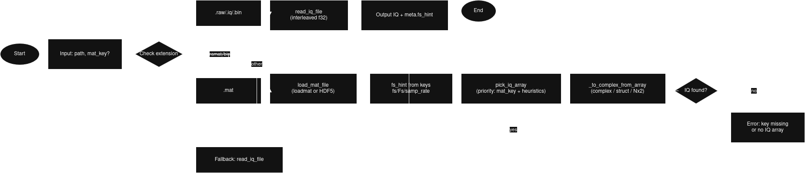
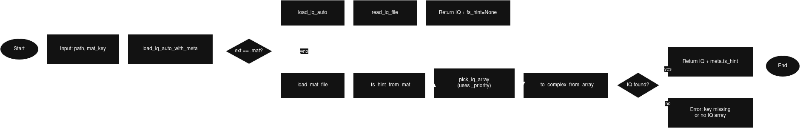
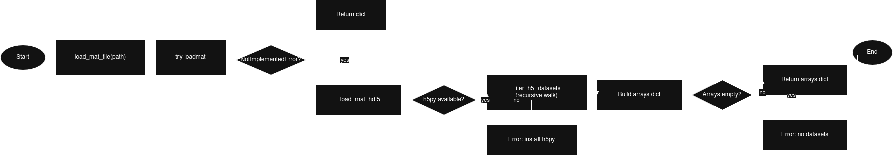
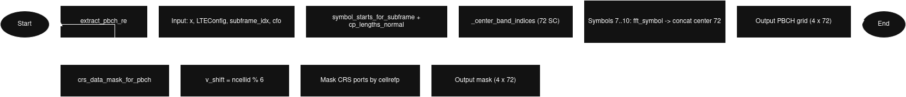
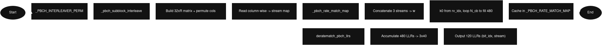
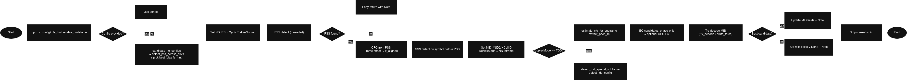
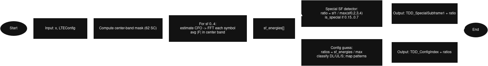
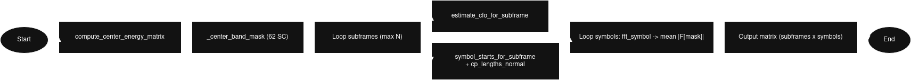

# Code and System Architecture

This document explains the end‑to‑end structure of the project, the major modules and functions, and how data flows from raw IQ samples to decoded LTE broadcast parameters.

## Overview
The goal of this project is to extract cell identity and MIB fields from a single 5 ms LTE IQ capture. The following diagram illustrates the end-to-end pipeline from raw IQ samples to decoded LTE broadcast parameters.

The pipeline consists of the following main stages:
- Goal: Extract cell identity and MIB fields from a single 5 ms LTE IQ capture (Fs=15.36 MHz, 10 MHz BW).
- Pipeline stages:
  1) Load IQ and set LTE numerology (config)
  2) PSS detection (NID2) across slots
  3) SSS detection (NID1) on the symbol preceding PSS; infer duplex mode and subframe index
  4) PBCH resource extraction on subframe 0; common‑phase and amplitude normalization
  5) Soft demodulation (QPSK LLRs), de‑rate matching, Viterbi decoding, CRC/MIB checks
  6) Brute‑force fallback for NCellID when needed, restricted by measured NID2

## Repository Layout (code)
- `src/lte_params.py`
  - Core LTE helpers: FFT, CFO estimation, symbol timing per subframe
  - Synchronization: PSS/SSS generation and detection
  - High‑level driver: `analyze_lte_iq`
- `src/pbch.py`
  - PBCH resource extraction, CRS masking, phase equalization
  - LLR computation, (de)rate matching, descrambling variants
  - Viterbi decoder (K=7, rate‑1/3) and MIB parsing attempt
  - Brute‑force MIB search over `NCellID` (filtered by NID2)
- `scripts/run_analysis.py`
  - CLI entry point: loads `LTEIQ.raw`, runs `analyze_lte_iq`, prints a concise summary
- `scripts/mat_to_raw.py`
  - CLI helper to convert MATLAB .mat files to the interleaved float32 .raw format.
- `notebooks/LTE_Analiz.ipynb`
  - Presentation notebook with a step‑by‑step walkthrough and >10 figures
- `docs/paper.md`
  - Single‑page scientific summary of the project

## Configuration (`LTEConfig`)
Defined in `src/lte_params.py`, encapsulating numerology for 10 MHz LTE. These values drive symbol timing, FFT sizing, and indexing used throughout the code.

- `fs`, `nfft`, `subcarrier_spacing`, `cp_slot`, `symbols_per_slot`, `slots_per_subframe`, `slot_samples`, `subframe_samples`, `ndlrb`.

## Signal Acquisition and Synchronization
The first step is to load the IQ data from a file. The system supports both raw interleaved float32 files and MATLAB `.mat` files.

- `read_iq_file(path)`: Loads interleaved float32 I/Q as complex64.
- `symbol_starts_for_subframe(config, start)`: Computes time indices for the 14 symbols in a subframe (Normal CP).

The next step is to perform CFO (Carrier Frequency Offset) estimation and apply corrections.

- `fft_symbol(x, start, cp_len, nfft, cfo)`: Applies CFO rotation and returns `fftshift(FFT)`.
- CFO estimation:
  - `coarse_cfo_estimate(symbol_td, cp_len, nfft)`: CP correlation based CFO per symbol.
  - `estimate_cfo_for_subframe(x, config, subframe_idx)`: Median CFO across the subframe.

After CFO correction, we perform PSS (Primary Synchronization Signal) and SSS (Secondary Synchronization Signal) detection to synchronize with the cell.

- PSS/SSS:
  - `generate_pss_fd(nfft, nid2)`: Frequency‑domain PSS mapped to center 62 bins.
  - `pss_detect_in_symbol(fft_sym, nfft)`: Correlates the 62 center bins vs. all NID2∈{0,1,2} and returns the best.
  - `generate_sss_fd(nfft, nid1, nid2, is_subframe0, fdd)`: Deterministic SSS generator (FDD/TDD mapping), mapped to the center 62 bins.
  - `sss_detect_in_symbol(fft_sym, nfft, nid2)`: Brute‑force over nid1∈[0..167], subframe∈{0,5}, duplex∈{FDD,TDD} to find the maximum correlation; returns `(nid1, metric, is_subframe0, is_fdd)`.

## PBCH Extraction and Equalization (`src/pbch.py`)
Once synchronized, the PBCH (Physical Broadcast Channel) is extracted and equalized. This channel carries the MIB (Master Information Block).

- `extract_pbch_re(x, cfg, subframe_idx, cfo)`: Returns complex REs of shape `(4, 72)` for PBCH (slot 1, symbols 0..3, center 6 RB) using the given subframe-wide CFO.
- `crs_data_mask_for_pbch(ncellid, cellrefp=1)`: Boolean mask `(4,72)` that blanks only the CRS REs actually present for the requested `CellRefP` (ports 0/1 on symbol 0, ports 2/3 on symbol 1 for Normal CP PBCH).
- `pbch_equalize_with_crs(pbch_re, ncellid, ndlrb, cellrefp=2)`: Builds the spec CRS sequences, samples their pilot REs inside the PBCH grid, interpolates a per-subcarrier channel, and returns MATLAB-like equalised PBCH symbols alongside the estimated CFR.
- Phase/amplitude equalization:
  - `estimate_common_phase(pbch_re)`: Averages unit vectors to estimate common phase (returns angle to apply).
  - `apply_phase(pbch_re, theta)` and `normalize_amplitude(pbch_re)`: Lightweight EQ.

## Soft Demodulation and Decoding
The equalized PBCH symbols are then demodulated into soft bits (LLRs), which are then de-rate matched, descrambled, and finally decoded using a Viterbi decoder to recover the MIB payload.

- LLRs: `qpsk_llrs(pbch_eq, noise_var=1.0)` maps QPSK symbols to soft bits.
- De‑rate matching:
  - `deratematch_pbch_llrs(llrs480, i_mod4)`: Standard‑inspired 480→120 softbit accumulation per redundancy version.
- Descrambling (LLR‑domain):
  - `_gold_seq(c_init, length)` and `pbch_scramble_seq_variants(length, ncellid, i_mod4)`: Includes the spec PBCH scrambler `c_init=(NCellID<<9)|(i_mod4<<5)|0x1FF` plus legacy heuristics for robustness.
  - `descramble_llrs(llrs, ncellid, i_mod4)`: Applies sign `(+/−)` to LLRs using the selected scrambling sequence.
- Viterbi: `viterbi_decode_rate13_k7(llrs)` (rate 1/3, K=7) recovers 40 bits; split into 24‑bit payload + 16‑bit CRC.
- CRC/MIB:
  - `crc16_ccitt_bits(bits)` and mask hypotheses; `parse_mib_fields(payload24, i_mod4)` returns `NDLRB_from_MIB`, `PHICHDuration`, `Ng`, `NFrame`.

## Putting It Together (MIB)
- `try_decode_mib_from_pbch(pbch_re, ncellid)`:
  1) Mask CRS, compute LLRs, create 480‑softbit windows (up to three evenly spaced windows)
  2) For each `i_mod4` and selected scrambling variants, generate 120 LLRs (quality gate on mean |LLR|)
  3) Viterbi decode → (payload, CRC); accept if CRC matches under allowed masks and fields are plausible
  4) Returns a dict with `CellRefP`, `PHICHDuration`, `Ng`, `NFrame`, `NDLRB_from_MIB` on success
- `brute_force_mib_from_pbch(pbch_re, ncellid_hint=None, nid2_hint=None)`:
  - Iterates candidate `NCellID` values (restricted to `3*nid1 + nid2_hint` when available); calls the above method; stops at first plausible MIB.

## High‑Level Driver
The `analyze_lte_iq` function in `src/lte_params.py` is the high-level driver that orchestrates the entire analysis pipeline.

- `analyze_lte_iq(x, config=LTEConfig(), enable_bruteforce=True)` (`src/lte_params.py`):
  - If `config` is omitted, the analyzer auto-selects among standard LTE bandwidths (1.4/3/5/10/15/20 MHz, Normal CP) using the best PSS metric; an `fs_hint` (from `.mat` metadata) biases the choice toward the matching sampling rate.
  - Sets `NDLRB` and `CyclicPrefix` based on config
  - Runs PSS/SSS to populate `NID2`, `NID1`, `NCellID`, `DuplexMode`, `NSubframe`
  - Runs PBCH: CFO (subframe-wide), PBCH RE extraction, phase-only EQ plus optional CRS-based EQ candidates. Set `enable_bruteforce=False` to mimic MATLAB LTE Toolbox behaviour (only decode the measured PCI without the expensive brute-force search).
  - Tries MIB via `try_decode_mib_from_pbch`; if needed runs `brute_force_mib_from_pbch`
  - Returns a dictionary with all available fields; includes TDD heuristics (`TDD_SpecialSubframe1`, `TDD_ConfigIndex`) when TDD

## CLI and Notebook
The project provides two command-line scripts for analysis and data conversion, and a Jupyter notebook for presentation.

- CLI (`scripts/run_analysis.py`):
  - Usage: `python scripts/run_analysis.py input.raw` (also accepts `.iq` or `.mat`; add `--key VAR` for MATLAB variable selection)
  - Flags: `--no-bruteforce` to skip PBCH PCI search (faster), `--bruteforce-limit N` to cap candidates (0 for unlimited)
  - `.mat` files with scalar `fs`/`Fs`/`samp_rate`/`sample_rate` provide a sampling-rate hint to the auto bandwidth selector.
  - Prints a concise summary via `pretty_print_results`

- CLI (`scripts/mat_to_raw.py`):
  - Usage: `python scripts/mat_to_raw.py input.mat -o output.raw`
  - Converts a MATLAB `.mat` file containing IQ data into an interleaved float32 `.raw` file suitable for the analysis script.
- Notebook (`notebooks/LTE_Analiz.ipynb`):
  - End‑to‑end demo; plots for PSS/SSS correlations, PBCH spectra and scatter, LLR histograms, energy heatmaps, TDD heuristics, etc.

## Performance and Tunables
- Brute‑force is restricted by:
  - `nid2_hint` (from PSS) → candidate `NCellID` set is reduced to 168 values
  - Scrambler variants (best 2–3), and at most 3 windows per 480‑softbit segment
  - Early rejection if mean(|LLR|) < 0.2
- Typical runtime: ~10–60 s depending on CPU and input SNR.

## Extensibility
- Replace de‑rate matching with spec‑accurate 36.212 interleaving and circular buffer.
- Improve CRS‑based channel estimation/interpolation for PBCH bandwidth.
- Support multi‑frame soft combining over the four PBCH repetitions (40 ms) for robust MIB.
- Tighten CRC masking to spec‑accurate treatment and include CellRefP derivation from CRC scrambling.

## Troubleshooting
- No `NCellID` or weak PSS/SSS metrics: check SNR, sample rate, file path, and that the capture contains downlink subframes.
- MIB not decoded: try a longer recording (≥40 ms), or relax quality gates/log intermediate metrics.
- Performance: reduce windows/scrambler variants or skip brute‑force when a confident `NCellID` is available.

## References
- See `docs/paper.md` (References section) or `README.md` for a curated list with working links.
