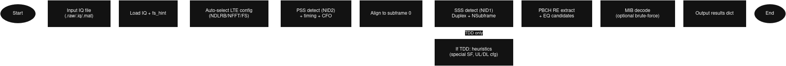
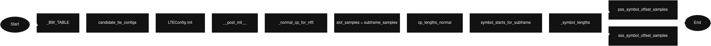
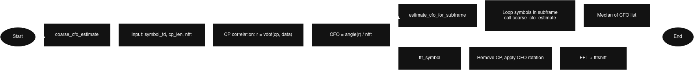
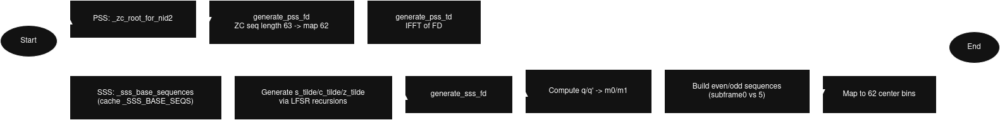
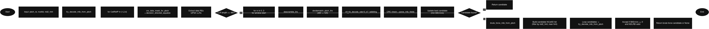
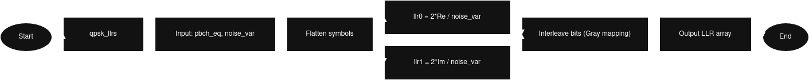
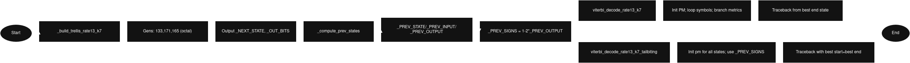
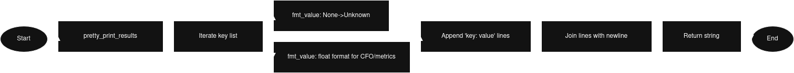

# Proje Sunumu: LTE IQ Verisinden Yayın Parametrelerinin Çıkarımı

---

## Slayt 1: Başlık Sayfası

**Proje Adı:** Kısa IQ Kaydından LTE Hücre Parametrelerinin Tespiti ve Master Information Block (MIB) Çözümlenmesi

**Problem Tanımı:** Gürültülü ve frekans kayması içeren 5 milisaniyelik bir LTE aşağı-yön (downlink) IQ kaydından, hücrenin temel yayın parametrelerini (Hücre Kimliği, Bant Genişliği, Sistem Çerçeve Numarası vb.) güvenilir bir şekilde çıkarmak.

**Anahtar Kelimeler:** LTE, PSS, SSS, PBCH, MIB, CFO, OFDM, Kanal Eşitleme.

**Görsel:** Projenin genel bakışını özetleyen akış diyagramı.


---

## Slayt 2: Algoritmik Akış (Genel Bakış)

**Mesaj:** Proje, IQ verisini alıp bir dizi sinyal işleme adımından geçirerek hücre parametrelerini çıkaran uçtan uca bir boru hattı olarak tasarlanmıştır.

**Blok Diyagram:**
*Bu diyagram, verinin hangi aşamalardan geçerek anlamlı bilgiye dönüştüğünü göstermektedir.*
```mermaid
flowchart LR
    style A fill:#f9f,stroke:#333,stroke-width:2px
    style I fill:#ccf,stroke:#333,stroke-width:2px

    A[IQ Kaydı (.mat)] --> B(Yükleme ve Ön İşleme);
    B --> C{Senkronizasyon};
    C --> |1. PSS Tespiti| D[Zamanlama ve NID₂];
    C --> |2. SSS Tespiti| E[Çerçeve Zamanlaması ve NID₁];
    E --> F[PBCH Konumlandırma];
    F --> G(Kanal Eşitleme);
    G --> H{MIB Çözümleme};
    H --> |Viterbi & CRC| I[Çıktı: MIB Parametreleri];

```
**Algoritmanın Ana Çıktıları:**
- **`NCellID`**: Hücrenin fiziksel kimliği (0-503).
- **`NDLRB`**: Aşağı-yön bant genişliği (6, 15, 25, 50, 75, 100).
- **`DuplexMode`**: FDD veya TDD.
- **MIB İçeriği**: `phichDuration`, `ng`, `systemFrameNumber` (SFN).

---

## Slayt 3: LTE Numerolojisi ve OFDM Yapısı

**Mesaj:** Algoritmamız, standart LTE zaman-frekans yapısını temel alır. 10 MHz bant genişliğine sahip bir sinyal için parametreler aşağıdaki gibidir.

**Görsel:** OFDMA sembollerinin zaman ve frekans domenindeki yerleşimi.


**Tablo: 10 MHz FDD Sistemi için Temel Parametreler**
| Parametre | Değer | Açıklama |
|---|---|---|
| Bant Genişliği | 10 MHz | - |
| `NDLRB` | 50 | Kullanılabilir kaynak bloğu sayısı |
| `Fs` | 15.36 MHz | Örnekleme frekansı |
| `NFFT` | 1024 | FFT boyutu (güç-2) |
| `Δf` | 15 kHz | Alt taşıyıcı (subcarrier) aralığı |
| Döngüsel Ön Ek (CP) | Normal | Sembol başına 72/80 örnek |
| Sembol/Slot | 7 | Normal CP için |

**Temel Denklem:** Örnekleme frekansı ($F_s$), FFT boyutu ($N_{FFT}$) ve alt taşıyıcı aralığı ($\Delta f$) arasındaki ilişki:
$$
F_s = N_{FFT} \cdot \Delta f
$$

---

## Slayt 4: Adım 1 - IQ Yükleme ve CFO Düzeltmesi

**Mesaj:** Ham IQ verisi dosyadan okunur ve Taşıyıcı Frekans Kayması (CFO), döngüsel ön ek (CP) korelasyonu ile kaba bir şekilde tahmin edilip düzeltilir.

**Algoritma:**
1.  `.mat` formatındaki IQ verisini `numpy` dizisi olarak yükle.
2.  Bir OFDM sembolünün CP kısmını, sembolün son kısmı ile korele et.
3.  Korelasyon sonucunun faz açısından frekans kaymasını (radyan/örnek) hesapla.
4.  Tüm IQ sinyalini bu kaymanın tersiyle çarparak düzelt.

**Görsel:** CFO'nun frekans domeninde yarattığı etki.


**Denklem (CFO Tahmini):** CP (uzunluk $N_{CP}$) ve sembol sonu arasındaki faz farkı.
$$
\hat{\omega} = \frac{1}{N_{FFT}} \angle \left( \sum_{n=0}^{N_{CP}-1} x[n] \cdot x^*[n+N_{FFT}] \right)
$$

---

## Slayt 5: Adım 2 - PSS Tespiti (Zamanlama ve NID₂)

**Mesaj:** Birincil Senkronizasyon Sinyali (PSS), 5ms'lik radyo çerçevesi zamanlamasını ve hücre kimlik grubunun bir parçasını (`NID₂`) bulmak için kullanılır.

**Algoritma:**
1.  Sinyali OFDM sembollerine böl ve FFT uygula.
2.  Her sembolün merkezindeki 62 alt taşıyıcıyı, 3 olası PSS dizisinden (NID₂ = 0, 1, 2) her biriyle korele et.
3.  En yüksek korelasyon metriğini veren sembolü ve PSS dizisini (NID₂) seç.

**Görseller:** PSS'nin frekans domenindeki konumu ve korelasyon tepe noktası.


**Denklem (Normalize Korelasyon):** Alınan sinyal ($y$) ile referans PSS ($s_{PSS}$) arasındaki benzerlik ölçütü. 1'e yakın değerler güçlü eşleşme demektir.
$$
\text{metric} = \frac{|\langle s_{\text{PSS}}, y \rangle|}{\|s_{\text{PSS}}\| \cdot \|y\|}
$$

---

## Slayt 6: Adım 3 - SSS Tespiti (Hücre Grubu ve NID₁)

**Mesaj:** İkincil Senkronizasyon Sinyali (SSS), 10ms'lik çerçeve başlangıcını ve hücre kimlik grubunu (`NID₁`) tespit eder. Bu adım, projenin en yoğun hesaplama gerektiren kısmıdır.

**Algoritma:**
1.  PSS'nin konumuna göre SSS'nin bulunması gereken sembolü belirle.
2.  Bu sembolü, 168 olası `NID₁` değeri, 2 olası alt-çerçeve konumu (0 veya 5) ve 2 olası dubleks modu (FDD/TDD) için üretilen tüm SSS dizileriyle (toplam 168 * 2 * 2 = 672 olasılık) "brute-force" korelasyonuna tabi tut.
3.  En yüksek korelasyonu veren `NID₁`, dubleks modu ve alt-çerçeve numarasını seç.

**Görsel:** SSS üretimi için gereken karıştırma dizileri.


**Nihai Hücre Kimliği:** `NCellID` = 3 * `NID₁` + `NID₂`

---

## Slayt 7: Adım 4 - PBCH Çözümleme Zinciri

**Mesaj:** `NCellID` ve zamanlama bilgisiyle, Fiziksel Yayın Kanalı'nın (PBCH) bulunduğu kaynak elemanlarını (RE) çıkarıp MIB'i elde edebiliriz.

**Algoritma Akışı:**
1.  **RE Çıkarımı:** PBCH'nin bulunduğu 4 OFDM sembolü içindeki 288 (4x72) kaynak elemanını çıkar.
2.  **Kanal Eşitleme:** Hücreye özgü referans sinyallerini (CRS) kullanarak kanal etkisini tahmin et ve PBCH sembollerini bu etkiye bölerek düzelt (Zero-Forcing).
3.  **QPSK Demodülasyonu:** Eşitlenmiş sembollerden Log-Olasılık Oranları (LLR) hesapla. LLR'lar, Viterbi kod çözücü için "yumuşak" bit bilgisi sağlar.
4.  **Rate De-matching & Viterbi:** LLR dizisini MIB'in orijinal uzunluğuna geri döndür ve evrişimsel kodu (convolutional code) çözmek için Viterbi algoritmasını kullan.
5.  **CRC Kontrolü:** Çözülen 24 bitlik MIB'in sonundaki 16 bitlik CRC (Döngüsel Artıklık Kontrolü) kodunun geçerli olup olmadığını kontrol et.

**Görsel:** PBCH çözümleme adımlarının özeti.


---

## Slayt 8: Kanal Eşitleme ve QPSK LLR

**Mesaj:** Kanalın bozucu etkisini (zayıflama ve faz kayması) gidermek ve gürültüye dayanıklı bir bit tahmini yapmak bu adımın temel hedefleridir.

**Görseller:** Kanal Eşitleme ve LLR hesaplama adımları.



**Denklem 1 (Zero-Forcing Kanal Eşitleme):** 
$$
\mathbf{Y} = \mathbf{H} \cdot \mathbf{X} + \mathbf{N} \quad \implies \quad \hat{\mathbf{X}} = \frac{\mathbf{Y}}{\hat{\mathbf{H}}}
$$
- $\mathbf{Y}$: Alınan Sinyal, $\mathbf{H}$: Kanal Tepkisi, $\mathbf{X}$: Gönderilen Sinyal, $\hat{\mathbf{X}}$: Tahmin Edilen Sinyal

**Denklem 2 (QPSK LLR):** Eşitlenmiş bir QPSK sembolü ($y = y_I + j \cdot y_Q$) için yumuşak bit tahmini.
$$
\text{LLR}(b_0) \propto \frac{y_I}{\sigma^2_n}, \quad \text{LLR}(b_1) \propto \frac{y_Q}{\sigma^2_n}
$$
- $\sigma^2_n$: Gürültü varyansı. LLR değeri ne kadar büyükse, bitin o değerde olduğuna dair güven o kadar yüksektir.

---

## Slayt 9: Viterbi Kod Çözücü

**Mesaj:** Viterbi algoritması, kanal gürültüsü nedeniyle oluşmuş olası bit hatalarını düzeltmek için kullanılır. MIB'i koruyan evrişimsel kodun en olası orijinal bit dizisini bulur.

**Görsel:** Viterbi algoritmasının Trellis diyagramı üzerinde en olası yolu bulması.


**Algoritma Prensibi:**
-   Alınan LLR dizisine dayanarak, Trellis diyagramındaki tüm olası yolların metriklerini hesaplar.
-   Her adımda, hayatta kalan en olası yolu (survivor path) korur.
-   Sona ulaşıldığında, en düşük kümülatif metriğe sahip yolu geri izleyerek orijinal bit dizisini yeniden oluşturur.

---

## Slayt 10: Sonuçlar ve Örnek Çıktı

**Mesaj:** Algoritmamız, 5ms'lik kısa bir kayıttan bile yüksek doğrulukla hücre parametrelerini ve MIB içeriğini başarıyla çıkarmıştır.

**Görsel:** Programın terminale bastığı örnek çıktı.


**Tablo: Tipik Bir Başarılı Çözümleme Sonucu**
| Parametre | Değer | Açıklama |
|---|---|---|
| `NCellID` | 455 | Başarıyla bulundu (NID₁=151, NID₂=2) |
| `PSS_metric` | 0.967 | Çok güçlü PSS eşleşmesi |
| `SSS_metric` | 0.994 | Çok güçlü SSS eşleşmesi |
| `DuplexMode` | FDD | SSS tespitinden bulundu |
| `NDLRB_from_MIB` | 75 | **Çözümlenen MIB'den gelen gerçek bant genişliği** (15 MHz) |
| `SystemFrameNumber`| 134 | MIB'den çözümlendi |
| `MIB_CRC_OK`| True | **MIB çözümlemesi başarılı** |

**Not:** İlk başta `NDLRB=50` (10 MHz) varsayımıyla başlasak bile, MIB'i çözdükten sonra hücrenin gerçek bant genişliğinin `NDLRB=75` (15 MHz) olduğunu keşfettik. Bu, algoritmanın dinamik olarak kendini düzeltebildiğini gösterir.

---

## Slayt 11: Karşılaşılan Zorluklar ve Öğrenimler

**Mesaj:** Bu proje sadece bir kodlama görevi değil, aynı zamanda pratik sinyal işleme zorluklarını ve teorik bilginin uygulamaya nasıl döküldüğünü anlamak için önemli bir öğrenme deneyimiydi.

**Zorluklar:**
1.  **Kısa Kayıt Süresi (5 ms):** Sinyalin sadece yarım radyo çerçevesi olması, PBCH'nin tüm tekrarlarını yakalayamama ve dolayısıyla SNR düşüklüğü riski getirdi.
2.  **Yüksek Frekans Kayması (CFO):** CFO'nun varlığı, OFDM sembolleri arasındaki ortogonalliği bozarak ciddi performans düşüşüne neden oldu. CP tabanlı düzeltme kritikti.
3.  **SSS Brute-Force Yoğunluğu:** 168 NID₁, 2 dubleks modu ve 2 alt-çerçeve olasılığını denemek, algoritmanın en yavaş adımıydı ve optimizasyon gerektiriyordu.

**Kazanımlar ve Öğrenimler:**
1.  **Teori ve Pratik Farkı:** 3GPP standartlarındaki teorik yapının, gürültü ve CFO gibi gerçek dünya etkileriyle nasıl başa çıkılması gerektiğini bizzat deneyimledim.
2.  **Hiyerarşik Çözümleme:** LTE senkronizasyonunun PSS -> SSS -> PBCH şeklindeki hiyerarşik yapısının neden bu şekilde tasarlandığını anladım. Her adım, bir sonraki için gerekli bilgiyi sağlar.
3.  **"Yumuşak" Kararların Gücü:** Kanal kod çözmede, QPSK sembollerinden doğrudan 0/1 bitleri yerine LLR (yumuşak bilgi) kullanmanın Viterbi kod çözücünün hata düzeltme performansını ne kadar artırdığını gördüm.
4.  **Metriklerin Önemi:** `PSS_metric`, `SSS_metric` ve `CRC` gibi kalite metriklerinin, algoritmanın her adımında ne kadar doğru ilerlediğimizi anlamak için ne kadar hayati olduğunu öğrendim.

---

## Slayt 12: Kaynakça ve Teşekkür

**Kullanılan Temel Kaynaklar:**
1.  **3GPP Standartları (En Kritik Olanlar):**
    -   TS 36.211: "Physical channels and modulation" (PSS/SSS/PBCH yapıları)
    -   TS 36.212: "Multiplexing and channel coding" (Rate matching, Viterbi)
    -   TS 36.213: "Physical layer procedures" (Hücre arama)
2.  **Online Referanslar:**
    -   **ShareTechnote:** (www.sharetechnote.com) PSS, SSS, PBCH ve MIB üzerine detaylı ve pratik açıklamalarıyla projenin her aşamasında en çok başvurduğum kaynak oldu.
3.  **Kitap:**
    -   Dahlman, Parkvall, Sköld, "4G: LTE/LTE-Advanced for Mobile Broadband".

**Teşekkür:** ...
